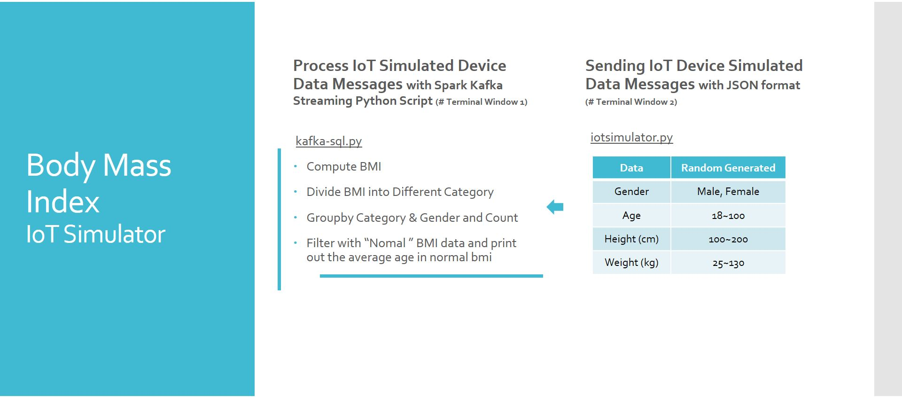
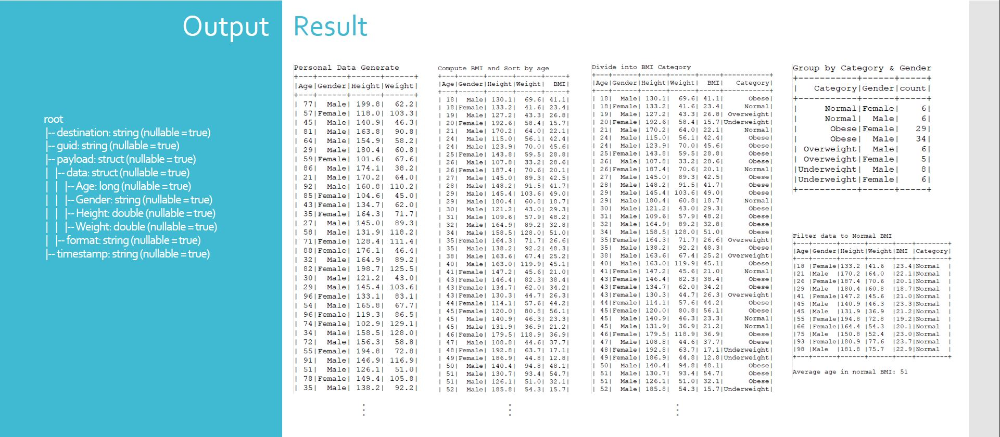

## The Internet of Things:  Big Data Processing
### BMI Simulator
The project is under the restrictions of what a AWS t2.micro is capable of, which limits it to one virtual Xeon core, 1 GB of memory and limited file storage.
The Iot data messages here is from a doby index simulator to randomly generate data.

Step 1: Open a new PuTTY session or ssh to AWS EC2 instance

Step 2: Process IoT Simulated Device Data Messages Using Spark Kafka IoT Big Data Streaming Python Script.

    > cd ${HOME}
    > spark-submit --packages org.apache.spark:spark-streaming-kafka-0-8_2.11:2.3.3 kafka-sql.py 34.223.248.243:9092 iotmsgs
	#...
	#...
	#-------------------------------------------
	#Time: 2022-06-01 07:36:21
	#-------------------------------------------
	#
	#-------------------------------------------
	#Time: 2022-06-01 07:36:23
	#-------------------------------------------
	#...
 

Step 3: In a separate PuTTY/SSH window, Use IoT Device Data Simulator to send 1000 messages

    > cd ${HOME}
    > KAFKA_HEAP_OPTS="-Xmx20M" \
	  ./iotsimulator.py 1000 | python -m json.tool | kafka_*/bin/kafka-console-producer.sh --broker-list 34.223.248.243:9092 --topic iotmsgs
		 
	
 
